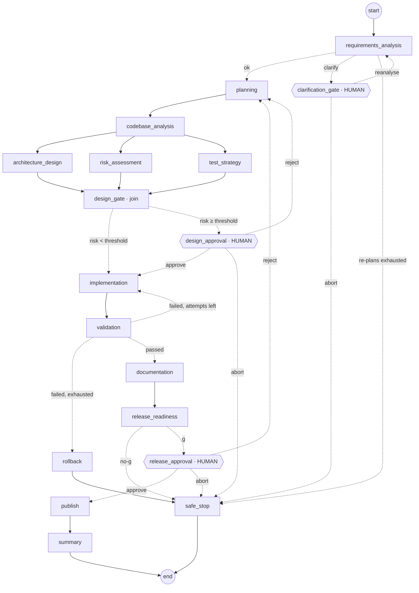

# Architecture overview

## 1. Components

```
┌──────────────────────────────── Spring Boot 3.4 application (Java 21) ────────────────────────────────┐
│                                                                                                        │
│  com.example.shortener  (system under construction)          com.example.sdlc  (agentic orchestrator) │
│  ─────────────────────                                        ──────────────────────────────────────── │
│  web/      ShortUrlController, RedirectController             api/        SdlcController, RunView       │
│  service/  ShortUrlService (use cases), UrlValidator,         graph/      SdlcOrchestrator (lifecycle)  │
│            CodeGenerator, TokenBucketRateLimiter,                         SdlcGraphFactory (LangGraph)  │
│            ShortUrlStore (port)                                           SdlcState (checkpointed)      │
│  persistence/ JpaShortUrlStore (adapter), Spring Data repos               GovernedNode (decorator)      │
│  domain/   ShortUrl, ClickEvent (JPA), LinkStats               agents/     18 nodes (agents + gates)     │
│  db/migration  Flyway V1..                                    governance/ PolicyEngine + 9 rules,       │
│                                                                           ResilientExecutor, AuditLog,  │
│                                                                           ReliabilityMetrics, RunControl│
│                                                                codebase/   CodebaseIndex (static facts)  │
│                                                                llm/        LlmGateway port ─┐            │
│                                                                                            ▼            │
│                                                              OllamaLlmGateway  (Spring AI OllamaChatModel,│
│                                                                 AgentModelRoster, OllamaHealthProbe)    │
│                                                              OfflineLlmGateway (OLLAMA_ENABLED=false)   │
└──────────────────────────────────────────────────────┬─────────────────────────────────────────────────┘
                                                       │ HTTP /api/chat (per-agent model, JSON-schema format)
                                                       ▼
                                      Ollama server ── llama3.1:8b        (reasoning agents)
                                                   └─ qwen2.5-coder:7b   (coding agents)
```

**Ports and adapters in both parts.** The shortener's business rules depend on `ShortUrlStore`, not on JPA. The orchestrator's agents depend on `LlmGateway`, not on Spring AI. Both cores are plain Java. That is why the whole graph can run in unit tests with no Spring context and no network.

## 2. Multi-agent model layer (Spring AI + Ollama)

Each LLM-backed node of the graph is a separate agent with its own system prompt, its own typed output record, its own guard and its own **Ollama model**. All agents share one Spring AI `OllamaChatModel` bean. `OllamaLlmGateway` picks the model per request with `OllamaOptions`, which Spring AI merges over the defaults.

| Agent (graph node) | Default model | Why this model |
|---|---|---|
| requirements_analysis, planning, architecture_design, risk_assessment, documentation | `llama3.1:8b` (`OLLAMA_REASONING_MODEL`) | Instruction following and reasoning over prose |
| codebase_analysis, test_strategy, implementation | `qwen2.5-coder:7b` (`OLLAMA_CODER_MODEL`) | Reading and writing Java, SQL and tests |

You can override any agent in `sdlc.llm.agent-models` (for example `implementation: qwen2.5-coder:14b`).

How the layer is kept reliable with local models:

- **Schema-constrained decoding.** The JSON schema of each agent's output record (from Spring AI's `BeanOutputConverter`) is sent as Ollama's `format`, so the model can only produce JSON of that shape. `structured-output: JSON` is the looser option for older Ollama servers.
- **Output cleaning.** `<think>` blocks from reasoning models, markdown fences and chatter around the JSON are removed before parsing. The last closing fence is used, because generated docs contain fences of their own.
- **Liveness.** `OllamaHealthProbe` checks `GET /api/tags`, cached for 15 s. If Ollama is down, agents switch to their deterministic strategies at once instead of waiting on timeouts, and switch back when it returns. The app always starts.
- **Model fallback.** If an agent's model is not pulled, the default model is used. If that is missing too, the agent uses its deterministic strategy. `GET /api/v1/sdlc/agents` lists the missing models and the `ollama pull` commands.
- **Attribution.** Every decision records the model that made it, e.g. `agent:implementation/llm[ollama:qwen2.5-coder:7b]`. So the lineage shows which model is behind each artifact.
- **Governance is never delegated.** Whatever the model returns still passes the agent's guard, the policy engine, the risk floor and the human gates.

## 3. Orchestration model

The compiled LangGraph4j graph (exported at runtime by `GET /api/v1/sdlc/graph`):



| Requirement from the brief | How it is implemented |
|---|---|
| Explicit dependency graph | `StateGraph<SdlcState>` with 18 nodes. Plain and conditional edges are declared in one place (`SdlcGraphFactory`). |
| Entry/exit gates | Every stage has an entry precondition (e.g. `planning` requires a spec; `design_gate` requires all three branch outputs; `publish` re-checks approval and validation itself) and an exit decision on a conditional edge. |
| Sequential and parallel paths with synchronisation | `codebase_analysis` fans out to `architecture_design`, `risk_assessment` and `test_strategy`, which LangGraph runs as a parallel node. They join at `design_gate`, a barrier that fails fast if any branch output is missing. |
| Cross-stage context and decision lineage | `SdlcState` is checkpointed after every node. `decisions`, `approvals`, `feedback` and `executionPath` are **append-only reducer channels**. Every artifact carries `planVersion`, `producedBy`, `derivedFrom` and `sha256`. |
| Human approval for high-impact actions | `interruptBefore(clarification_gate, design_approval, release_approval)`. The orchestrator injects the decision with `updateState` and resumes with `GraphInput.resume()`. Approvers are checked against an allow-list, both in the orchestrator and again in the gate node. |
| Bounded retries | Agent calls: `ResilientExecutor` with N attempts and exponential backoff. Implement ⇄ validate: at most `max-implementation-attempts`, with concrete violations fed back. Re-plans: at most `max-replans`. Whole run: `max-node-executions` (autonomy budget). LangGraph `recursionLimit` is also set. |
| Fallback | LLM primary → deterministic strategy when the LLM errors, times out, or returns output rejected by a guard (cyclic plan, made-up file path, missing mitigation...). |
| Rollback | `rollback` restores the frozen **design baseline** artifacts and discards failed code. `publish` is the only node with external side effects and runs only after release approval. |
| Safe-stop | `safe_stop` terminal node (on abort, exhausted loops, no-go). There is also an operator kill switch (`RunControl`), honoured at node boundaries, and `SafeStopException` for autonomy-budget exhaustion. The last checkpoint is kept, and `/resume` continues from it. |
| Policy guardrails | `PolicyEngine` rules. **Security:** SEC-001 secrets, SEC-002 SQL concatenation, SEC-003 dangerous APIs. **Compliance:** CMP-001 personal data in logs. **Change control:** CHG-001 write scope and path traversal, CHG-002 immutable/additive migrations, CHG-003 blast-radius creep. **Quality:** QA-001 AC→test traceability, QA-002 structural completeness. |
| Audit-grade observability | `HashChainedAuditLog`: every node start, finish and failure, every retry and fallback, every human decision and interrupt. Each event is `sha256(prevHash + event)`, and `GET /audit` returns `chainVerified`. It is mirrored to JSONL, and a copy ships with the published artifacts. |
| Reliability metrics | `ReliabilityMetrics`: success rate, node failures, retries, fallbacks, rollbacks, validation failures, re-plans, human approvals and rejections, **MTTR** (first failure → next successful validation or recovery), average and p95 **end-to-end latency**, agent processing time, and per-node latency. |
| Dynamic re-planning | The plan version increments when (a) a clarification changes the requirement, (b) impact analysis finds facts the plan did not assume (schema change → migration task; capability already exists → task dropped), or (c) a reviewer rejects (feedback becomes a task). A readiness check rejects artifacts from a stale plan version. |
| Controlled autonomy | Agents *propose* artifacts; they never write to the repo. Agents can auto-approve a design only below the risk threshold. Risk has a deterministic floor that the LLM cannot talk down. Publishing always needs a human. |

## 4. Control flow of a run

1. `POST /runs` → `SdlcOrchestrator.start` registers the run and streams the graph with `threadId=runId`.
2. Each node runs inside `GovernedNode`: kill-switch check → budget check → audit START → agent → audit SUCCEEDED/FAILED with latency → metrics → append to `executionPath`.
3. The graph stops at an `interruptBefore` gate or at END. `settle()` reads the checkpoint (`StateSnapshot.next()`) and derives the status (`AWAITING_*`, `COMPLETED`, `HALTED`).
4. `POST /decisions` validates the gate and approver, writes an audit record, calls `updateState(HUMAN_DECISION)` and resumes. The gate node records the decision in `approvals`, removes it from state (so it cannot be replayed), and the conditional edge routes.

## 5. Agents and their autonomy boundaries

| Node | Strategy (LLM → fallback) | Guard on the output | Boundary |
|---|---|---|---|
| requirements_analysis | LLM → vague-term / feature catalog | ACs present and `AC-n:` prefixed | Cannot skip a blocking ambiguity; only a human can |
| planning | LLM → template DAG | `PlanValidator`: unique ids, known deps, **acyclic** | — |
| codebase_analysis | LLM → symbol-reference analysis | Every path must exist in `CodebaseIndex` (made-up paths are dropped) | May re-plan (recorded as a decision) |
| architecture / risk / tests | LLM → catalog | Non-destructive DDL / mitigations present / every AC covered | Risk has a deterministic floor |
| design_gate | deterministic | — | Auto-approves only below the threshold |
| implementation | LLM → reference implementation + anchored patches | Files well formed | Output is artifacts only; the patcher fails loudly on anchor drift |
| validation, readiness, publish, summary | deterministic only | — | Never delegated to a model |

## 6. Key design decisions

1. **LangGraph4j over hand-rolled chaining.** It gives checkpointing, interrupts, parallel branches, reducers and graph export as tested building blocks. The value added here is the governance layered on top of it.
2. **The governance decorator (`GovernedNode`) rather than code in each agent.** Cross-cutting controls are applied uniformly and can't be forgotten by a new agent.
3. **Audit log outside the graph state.** Agents return state updates. If the audit trail lived in state, a buggy or compromised node could rewrite it. Keeping it outside, and hash-chained, makes tampering detectable.
4. **Design baseline as the rollback target.** The design is the last human- or policy-approved state. Rolling back to it avoids leaving partial code behind.
5. **Structured output through `BeanOutputConverter` with plain messages.** This gives typed agent contracts. Code in prompts is never treated as template syntax.
6. **Local models, routed per agent.** Ollama keeps code and requirements on the machine (no API keys, no data leaving the network). Giving code-heavy agents a code-tuned model and the rest a general model gets better output from small models than one model for everything. The cost is a smaller context window and weaker reasoning than frontier hosted models. That is why schema-constrained output and deterministic guards matter more here.
7. **Offline mode is a first-class feature.** It makes CI deterministic and demos reproducible, and it is the fallback path that keeps the pipeline available during model outages.

## 7. Parallelism note

LangGraph4j's parallel node re-emits the merged state. Append-only channels therefore use the de-duplicating appender, and entries are unique by construction (timestamps and step numbers). Parallel branches share one step number in `executionPath`, e.g. `04:architecture_design`, `04:risk_assessment`, `04:test_strategy`, which shows they ran concurrently. To run branches on separate threads, add `RunnableConfig.addParallelNodeExecutor(...)`.
